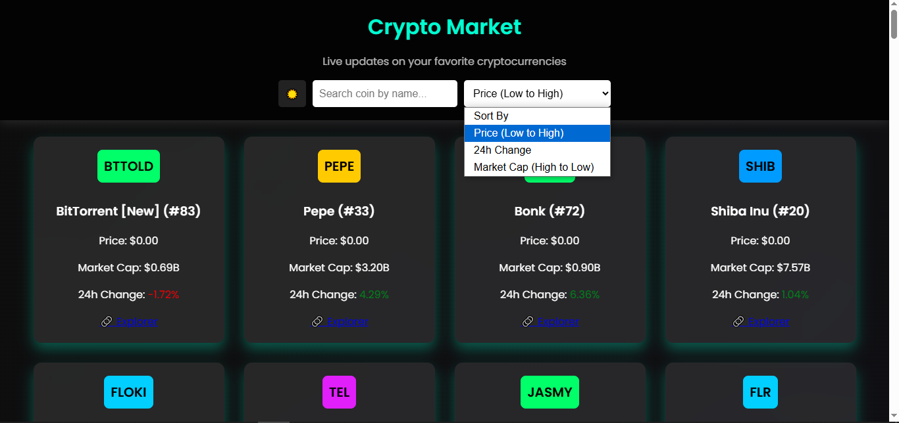
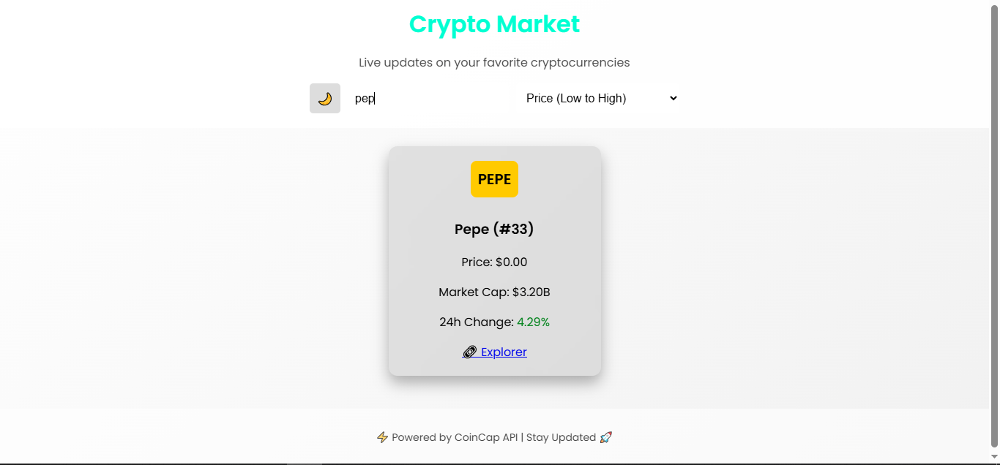

# 🚀 Crypto Market Dashboard

A **real-time cryptocurrency tracker** built using **HTML, CSS, and JavaScript**.  
Fetches live data from the **CoinCap API** and displays key details about the top cryptocurrencies.

## 🌟 Features

✅ **Live Crypto Updates** (Price, Market Cap, 24h Change)  
✅ **Search & Filter Options**  
   - 🔍 Search by name  
   - 📊 Sort by:
     - **Price (Low → High)**
     - **Market Cap (High → Low)**
     - **24h Change**  
✅ 🌙 **Light/Dark Mode Toggle**  
✅ 🔗 **Quick Links to Blockchain Explorer**  

---

## 🎥 Screenshots

### 🔵 Dark Mode


### ⚪ Light Mode


---

## 🛠️ Tech Stack

- **HTML** - Structure  
- **CSS** - Styling (Responsive & Themed)  
- **JavaScript** - API Fetching, Filtering, and Theme Toggle  
- **CoinCap API** - Real-time crypto data  

---

## 📦 Setup & Installation

### 🔽 Clone the Repository  
```sh
git clone  https://github.com/Huzaifa-Muhammed/Coin-Cap-Web-app.git
cd Coin-Cap-Web-app
